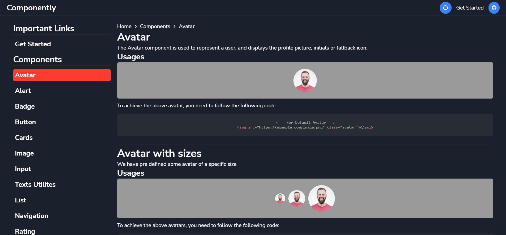

# Componently UI Component Library

Componently provides a robust, customizable, and accessible library of foundational and advanced components, enabling you to build your own design system and develop web applications faster.

You can access this component library using this link, [Componently](https://componently.netlify.app/).

## Tech Stack

**Used:** HTML, CSS

## Installation

You can add Componently to your Website via the free unpkg CDN. Just add the following <link> element into your page's <head>, before your project's stylesheets.

```html
<!-- Import a free cdn inside your head of your HTML file -->
<link
  rel="stylesheet"
  href="https://componently.netlify.app/styles/components.min.css"
/>

<!-- Use it like any other HTML element with our defined classes -->
<button class="btn btn-primary">Web Components!</button>
```

## Components

<ul>
  <li><a href="https://componently.netlify.app/components/Alert/">Alert</a></li>
  <li><a href="https://componently.netlify.app/components/avatar/">Avatar</a></li>
  <li><a href="https://componently.netlify.app/components/Badge/">Badge</a></li>
  <li><a href="https://componently.netlify.app/components/Button/">Button</a></li>
  <li><a href="https://componently.netlify.app/components/Card/">Card</a></li>
  <li><a href="https://componently.netlify.app/components/Grid/">Grid</a></li>
  <li><a href="https://componently.netlify.app/components/Image/">Image</a></li>
  <li><a href="https://componently.netlify.app/components/Input/">Input</a></li>
  <li><a href="https://componently.netlify.app/components/List/">List</a></li>
  <li><a href="https://componently.netlify.app/components/Navigation/">Navigation</a></li>
  <li><a href="https://componently.netlify.app/components/Rating/">Rating</a></li>
  <li><a href="https://componently.netlify.app/components/Snackbar/">Snackbar</a></li>
  <li><a href="https://componently.netlify.app/components/texts/">Texts</a></li>
  <li><a href="https://componently.netlify.app/components/Modal/">Modal</a></li>
</ul>

---

## Documentation Website Overview




Author: @spraveenofficial
